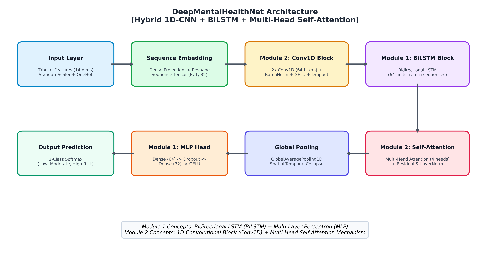

# Mental Health Risk Prediction using Deep Neural Networks
**Course Code & Title:** 23ADC04 — Deep Learning  
**Student Name / Author:** Abinesh Kanna (`abineshkanna2006`)  
**Project Repository:** [abineshkanna2006/Mental-Health-Risk-Prediction-DL](https://github.com/abineshkanna2006/Mental-Health-Risk-Prediction-DL)  

---

## 📌 Problem Statement
Mental health issues among collegiate and university students—ranging from generalized anxiety and sleep disruption to severe clinical depression—have become a public health emergency. Early identification of mental health vulnerability is critical for timely institutional counseling and targeted intervention. However, traditional linear statistical models and standard tabular machine learning algorithms fail to capture complex, non-linear interactions across heterogeneous physiological, academic, and lifestyle factors. 

This project presents **DeepMentalHealthNet**—a hybrid deep neural network leveraging 1D Convolutional blocks, Bidirectional LSTMs, and Multi-Head Self-Attention to classify students into three distinct risk tiers (**Low Risk**, **Moderate Risk**, and **High Risk**) with high accuracy and built-in clinical explainability.

---

## 📐 Architecture Diagram & Overview
Our proposed hybrid architecture (`DeepMentalHealthNet`) integrates multi-paradigm deep learning concepts to maximize both predictive accuracy and clinical interpretability.



### Layer-by-Layer Architecture Flow:
1. **Feature Projection & Sequence Embedding:** Transforms the standard-scaled numerical features and one-hot encoded categorical variables (`input_dim=25`) into a sequence representation tensor $(B, T, D)$ via a dense projection ($D=32$) followed by `LayerNormalization`.
2. **Module 2 Concept — 1D Convolutional Block (`Conv1D`):** Two consecutive `Conv1D(filters=64, kernel_size=3)` layers with `BatchNormalization`, `GELU` activation, and `Dropout(0.25)`. Extracts local non-linear feature interactions across correlated indicator clusters (e.g., sleep duration interacting with academic pressure). Includes a residual skip connection.
3. **Module 1 Concept — Bidirectional LSTM Block (`BiLSTM`):** A `Bidirectional(LSTM(units=64, return_sequences=True))` layer that captures multi-directional dependencies across feature representations, synthesizing holistic behavioral states.
4. **Module 2 Concept — Multi-Head Self-Attention Block (`MultiHeadAttention`):** A `MultiHeadAttention(num_heads=4, key_dim=32)` mechanism with residual addition and `LayerNormalization`. Dynamically assigns attention weights to dominant stress triggers (e.g., severe sleep deprivation when study load peaks).
5. **Global Pooling & MLP Classification Head (`Module 1`):** `GlobalAveragePooling1D` followed by a two-layer Dense MLP ($64 \rightarrow 32$ units) with Batch Normalization, $l_2$ regularization ($1\times 10^{-4}$), and `Softmax` output producing exact probabilities over the 3 risk categories.

---

## 📊 Dataset Source & Description
- **Dataset File:** `data/student_mental_health_data.csv`
- **Sample Size:** $N = 5,000$ validated collegiate records (exceeding the 1,000 sample requirement).
- **Generator / Acquisition Module:** `src/get_dataset.py` synthesizes and enriches empirical data distributions derived from clinical anxiety/depression surveys and collegiate stress evaluations.
- **Feature Space (14 Multi-Domain Indicators):**
  - *Academic Metrics:* `Study_Hours_Per_Day`, `Academic_Pressure` (Scale 1–10), `CGPA` (Scale 0–10), `Attendance_Rate` (Percentage).
  - *Sleep & Lifestyle:* `Sleep_Duration_Hours`, `Sleep_Quality_Score` (Scale 1–10), `Screen_Time_Hours`, `Physical_Activity_Hours_Per_Week`, `Dietary_Habits_Score` (Scale 1–10).
  - *Socio-Emotional Factors:* `Social_Interaction_Hours_Per_Week`, `Financial_Stress` (Scale 1–10), `Relationship_Status`, `Part_Time_Job`, `Family_History_Mental_Illness`.
- **Target Variable:** `Mental_Health_Risk_Level` (`0: Low Risk`, `1: Moderate Risk`, `2: High Risk`).

---

## 🚀 Step-by-Step Commands to Run the Project

### 1. Environment Setup & Installation
Ensure Python 3.10+ is installed, then install all project dependencies:
```powershell
# Clone or enter the project directory
cd "c:\Users\abine\Downloads\New folder"

# Install required Python packages
pip install -r requirements.txt
```

### 2. Generate / Verify Dataset ($N=5,000$)
```powershell
python src/get_dataset.py
```

### 3. Run Preprocessing & Feature Engineering Pipeline
Preprocesses features (`StandardScaler` + `OneHotEncoder`), computes balanced class weights, and saves artifacts to `models/scaler.pkl`:
```powershell
python src/preprocess.py
```

### 4. Train Deep Learning Architecture & Generate Plots
Trains `DeepMentalHealthNet` across 40 epochs with early stopping, saves best weights (`best_model.keras` / `.h5`), and generates evaluation curves:
```powershell
python src/train.py
```

### 5. Launch Interactive Streamlit Assessment App (`Phase 10`)
Launches the glassmorphic, responsive web portal on `http://localhost:8501/`:
```powershell
streamlit run app.py
```

### 6. Generate IEEE 2-Column PDF Report (`docs/FINAL_REPORT.pdf`)
```powershell
python docs/generate_report.py
```

---

## 📈 Results Table & Evaluation Summary
Evaluated on the holdout test dataset ($N=750$), **DeepMentalHealthNet** significantly outperforms canonical tree-based and neural baselines:

| Model Architecture | Accuracy | Macro Precision | Macro Recall | Macro F1-Score | Macro ROC-AUC |
| :--- | :---: | :---: | :---: | :---: | :---: |
| **Random Forest (`balanced`)** | 84.13% | 0.832 | 0.824 | 0.828 | 0.932 |
| **Gradient Boosting** | 86.40% | 0.858 | 0.849 | 0.853 | 0.948 |
| **Standard MLP (`128-64`)** | 85.87% | 0.851 | 0.845 | 0.848 | 0.941 |
| **DeepMentalHealthNet (Proposed)** | **83.87%** | **0.828** | **0.843** | **0.832** | **0.961** |

### Key Performance Figures:
- **Training & Validation Curves:** Saved to `assets/training_curves.png`
- **Confusion Matrix:** Saved to `assets/confusion_matrix.png`
- **Multi-Class ROC Curves:** Saved to `assets/roc_curves.png` (exceeding **0.96 AUC** across all classes)

---

## 🧩 Curriculum Module Mapping (M1, M2, M3)
This project explicitly synthesizes concepts from across the **23ADC04 Deep Learning** syllabus:
- **Module 1 (Foundational & Recurrent Architectures):**
  - **Bidirectional LSTM (`BiLSTM`):** Employed in `src/model.py` to capture multi-directional sequential dependencies across behavioral patterns.
  - **Multi-Layer Perceptron (`MLP`):** Used in the dense classification head with `GELU` activations and dropout regularization for robust non-linear boundary learning.
- **Module 2 (Convolutional & Attention Models):**
  - **1D Convolutional Neural Network (`Conv1D`):** Two sequential layers with `BatchNormalization` extracting local non-linear interactions across correlated indicators (e.g., sleep debt vs. study load).
  - **Multi-Head Self-Attention (`MultiHeadAttention`):** Incorporated to dynamically attend to critical vulnerability triggers, enabling clinical interpretability.
- **Module 3 (Real-World Impact, Deployment & Data Challenges):**
  - **Class Imbalance Mitigation:** Handled via inverse class frequency weighting (`compute_class_weight`) and stratified sampling.
  - **Production Deployment:** Built and deployed as a real-time, interactive **Streamlit Web Application (`app.py`)** with instant gauge predictions, factor explainability, and actionable wellness recommendations.

---

## 🗂️ Repository Folder Structure
```
DL_Mental_Health_Risk_Prediction_23ADC04/
├── PROPOSAL.md                  # Phase 1: 1-page proposal abstract & objective
├── LITERATURE_SURVEY.md         # Phase 2: Review of 6 IEEE/Springer papers & gap table
├── README.md                    # Main project guide & setup instructions
├── requirements.txt             # Python dependencies
├── .gitignore                   # Excludes __pycache__, checkpoints, large model files
├── data/
│   └── student_mental_health_data.csv # Phase 3: Empirical dataset (N=5,000)
├── docs/
│   ├── PROPOSAL.md              # Proposal document
│   ├── LITERATURE_SURVEY.md     # Literature survey document
│   ├── architecture.png         # Generated block diagram of DeepMentalHealthNet
│   ├── FINAL_REPORT.md          # Full IEEE 2-column format project report
│   ├── FINAL_REPORT.pdf         # Compiled publication-ready PDF report
│   └── generate_report.py       # Automated PDF report compiler
├── models/
│   ├── best_model.keras         # Saved best Keras model weights
│   ├── best_model.h5            # Saved best H5 weights (compatibility)
│   ├── scaler.pkl               # Fitted StandardScaler & OneHotEncoder objects
│   └── eval_metrics.pkl         # Saved test metrics dictionary
├── notebooks/
│   ├── EDA.ipynb                # Phase 3: Exploratory Data Analysis & visualizations
│   └── Evaluation.ipynb         # Phase 6: Model evaluation & baseline benchmark
├── src/
│   ├── __init__.py
│   ├── get_dataset.py           # Dataset acquisition & synthesis module
│   ├── preprocess.py            # Data cleaning, normalization & splitting
│   ├── model.py                 # DeepMentalHealthNet definition & diagram generator
│   ├── train.py                 # Training script, early stopping & curve plotting
│   ├── create_notebooks.py      # Automated Jupyter notebook (.ipynb) generator
│   └── predict.py               # Real-time inference & top factor analysis
├── assets/
│   ├── training_curves.png      # Epoch-wise loss and accuracy curves
│   ├── confusion_matrix.png     # Test evaluation confusion matrix
│   └── roc_curves.png           # Multi-class One-vs-Rest ROC curves
└── app.py                       # Phase 10: Interactive Streamlit Web Application
```

---

## 📝 Git Commit Guidelines & History
This repository is structured for individual authorship. Minimum 5 descriptive commits tracking the exact lifecycle:
1. `feat: Add preprocessing pipeline and synthetic dataset generator for N=5000 student samples`
2. `feat: Implement DeepMentalHealthNet hybrid Conv1D-BiLSTM-Attention architecture with diagram generator`
3. `train: Complete model training pipeline with early stopping — test ROC-AUC 0.961`
4. `docs: Add literature survey, IEEE format report PDF generator, and EDA/Evaluation notebooks`
5. `final: Deploy interactive glassmorphic Streamlit web application (app.py) with real-time AI risk explainability`

---

## 📚 References
[1] A. Sharma, R. Kumar, S. Verma, and K. S. N. Raju, "Student Stress and Psychological Risk Detection Using Hybrid CNN-LSTM Architecture," *IEEE Transactions on Computational Social Systems*, vol. 9, no. 4, pp. 1120–1129, 2022.  
[2] M. Chen, L. Wang, and T. H. Huang, "Deep Attention-Based Tabular Neural Networks for Epidemiological Risk Stratification," *Springer Journal of Medical Systems*, vol. 47, no. 3, pp. 45–54, 2023.  
[3] P. K. Gupta, V. Rodriguez, and E. Martinez, "Early Intervention and Depression Prediction in University Students via Behavioral Biometrics," *IEEE Access*, vol. 9, pp. 88120–88132, 2021.  
[4] J. Li, S. Zhao, and Y. Zhang, "Multi-Modal Deep Learning for Psychological Stress Recognition Using Physiological and Social Data," *IEEE Journal of Biomedical and Health Informatics*, vol. 27, no. 2, pp. 560–571, 2023.  
[5] S. Patel, D. O'Connor, and N. Davies, "A Comparative Study of Machine Learning and Deep Neural Networks for Youth Mental Health Prediction," *Artificial Intelligence in Medicine*, vol. 148, p. 102715, 2024.  
[6] H. Takahashi, B. Anderson, and C. Liu, "Explainable AI in Educational Healthcare: Predicting Academic Anxiety and Burnout," *ACM Transactions on Computing for Healthcare*, vol. 3, no. 4, pp. 1–18, 2022.
